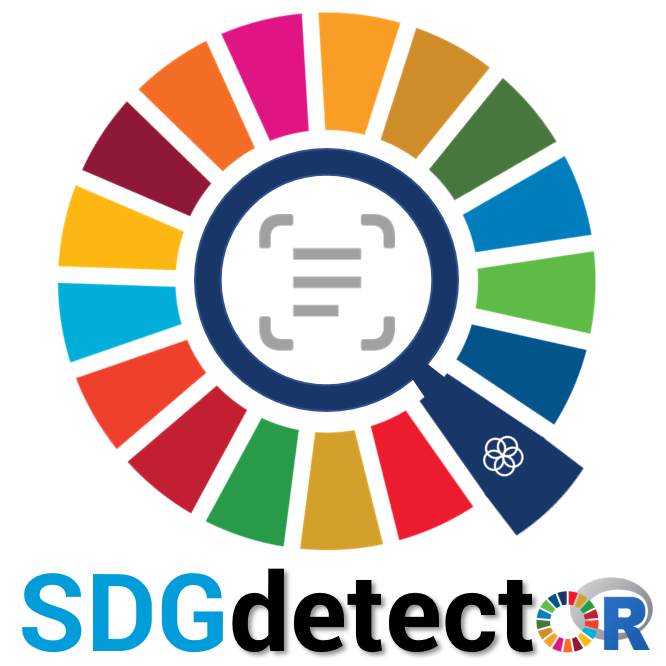
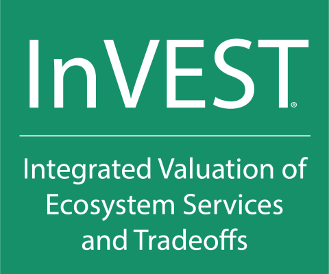

## Yingjie Li

I am a Postdoctoral Scholar with the [Natural Capital Project](https://naturalcapitalproject.stanford.edu/) at Stanford University, where I am dedicated to advancing cutting-edge science connecting nature exposure to human health and developing open-source tools for informing urban planning and public health policy. As an interdisciplinary scholar, I have broad interests in ecosystem service flows, international trade, and land-food-energy-water nexus. I received his Ph.D. in Environmental Science & Policy, as well as Fisheries and Wildlife, from the [Center for Systems Integration and Sustainability](https://www.canr.msu.edu/csis/) at Michigan State University, where I studied how [telecouplings](https://telecouplingtoolbox.org/) shape global sustainability and impact nations’ progress toward [Sustainable Development Goals (SDGs)](https://sdgs.un.org/goals). More information about my research can be found on my [personal website](https://yingjieli.netlify.app/).

---

### Selected Publications

<!-- HASHNODE:START -->
- [**Nature Cities** - Acute mental health benefits of urban nature](https://www.nature.com/articles/s44284-025-00286-y)
- [**Remote Sensing of Environment** - Satellite prediction of coastal hypoxia in the northern Gulf of Mexico](https://doi.org/10.1016/j.rse.2022.113346)
- [**Environmental Science & Policy** - Synthesizing social and environmental sensing to monitor the impact of large-scale infrastructure development](https://doi.org/10.1016/j.envsci.2021.07.020)
- [**Nature Sustainability** - Impacts of international trade on global sustainable development](https://doi.org/10.1038/s41893-020-0572-z)
- [**Nature** - Assessing progress towards sustainable development over space and time](https://doi.org/10.1038/s41586-019-1846-3)
<!-- HASHNODE:END -->

---

### Open-source Software

- **R package:** [SDGdetector](https://github.com/Yingjie4Science/SDGdetector) 

- **Python package:** [seesus](https://github.com/caimeng2/seesus)

- [**InVEST models**](https://github.com/natcap/invest) 

---

<!--  -->
